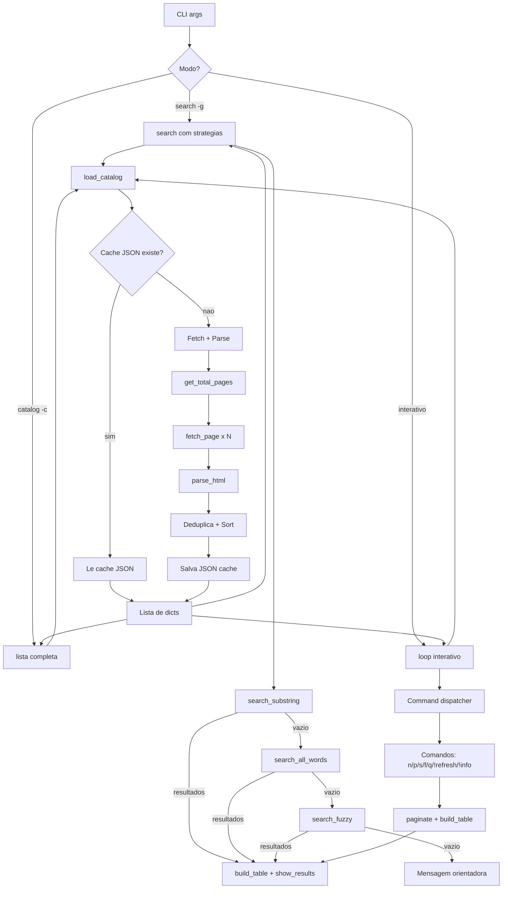
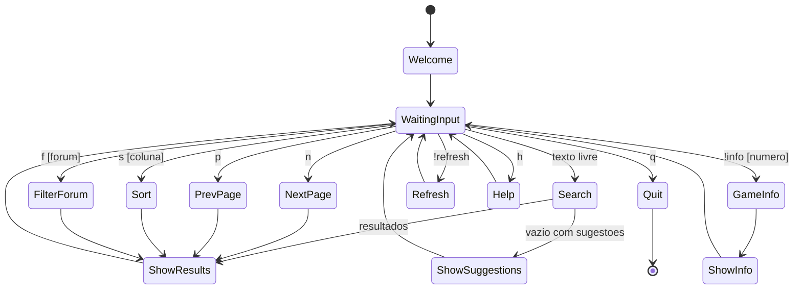
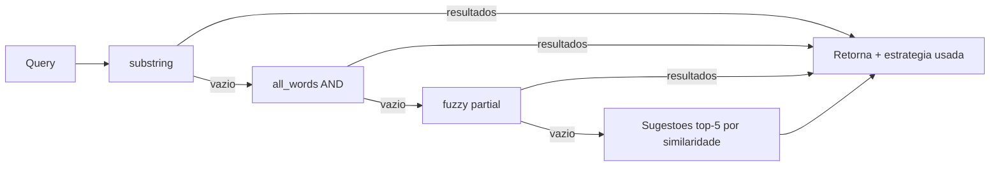

# Plano de Arquitetura: UI/UX & DX do rtlinux.py

**Data**: 2026-04-22
**Escopo**: Melhorar a listagem do catalogo, busca funcional para todos os jogos, catalogo navegavel sem erros

---

## 1. Analise do Estado Atual

### O que funciona
- Fetch assincrono com semaforo e cache em disco (HTML + JSON)
- Parsing robusto de HTML com fallbacks para seeds
- Deduplicacao por link, ordenacao alfabetica
- Tabela Rich com highlight de busca
- Modo interativo com `!refresh`

### Problemas identificados

| # | Problema | Impacto | Categoria |
|---|---------|---------|-----------|
| P1 | Busca substring retorna 0 resultados para termos parciais comuns (ex: "NieR" vs "NieR: Automata") | UX ruim -- usuario acha que o jogo nao existe | Busca/DX |
| P2 | `show_results()` exibe "[bold red]No games found[/bold red]" quando busca retorna vazio -- mensagem agressiva e sem orientacao | UX ruim -- parece erro, nao orientacao | UI/UX |
| P3 | Catalogo completo (200+ jogos) despeja tudo sem paginacao; com `-a` despeja milhares de linhas no terminal | UX ruim -- impossivel navegar | UI/UX |
| P4 | Limite fixo de 200 resultados corta silenciosamente; so menciona com `[dim]... N more[/dim]` | UX confuso -- usuario nao sabe quantos perdeu | UI/UX |
| P5 | Tabela nao permite ordenar por coluna (seeds, size, date) | Funcionalidade faltando | UI/UX |
| P6 | Nenhum filtro por forum no modo interativo (so via CLI) | Funcionalidade faltando | UI/UX |
| P7 | Modo interativo so tem `q` e `!refresh` -- sem paginacao, sem ajuda, sem filtros | UX limitada | UI/UX |
| P8 | Campo "Link" na tabela e inutil -- URL truncada, nao clicavel, ocupa espaco | UX desperdicio | UI/UX |
| P9 | `search()` faz fallback AND sem informar o usuario que mudou a estrategia | DX confuso -- resultado parece errado | DX |
| P10 | `load_catalog` com catalogo vazio (cache corrompido ou fetch falhou) da `sys.exit(1)` sem tentar recuperar | DX frágil | DX |

---

## 2. Estrutura do Sistema

### Componentes e responsabilidades

O sistema continua single-file por ora (justificativa na secao 4), mas internamente organizado em camadas logicas:

```
+---------------------------------------------------------------+
|                        CLI / Entry Point                       |
|  argparse -> escolhe modo (search / catalog / interactive)     |
+---------------------------------------------------------------+
                              |
                              v
+---------------------------------------------------------------+
|                      Catalog Service                           |
|  Carrega, cachea, deduplica, ordena o catalogo                |
|  load_catalog(), search(), sort_by(), filter_by_forum()        |
+---------------------------------------------------------------+
          |                                    |
          v                                    v
+-------------------------+    +-----------------------------+
|   HTTP / Fetch Layer    |    |      Cache Layer            |
|  fetch_url(),           |    |  Disk cache (HTML + JSON)   |
|  fetch_page(),          |    |  Validacao de integridade   |
|  get_total_pages()      |    |                             |
+-------------------------+    +-----------------------------+
          |
          v
+-------------------------+
|   Parse Layer           |
|  parse_html(),          |
|  _extract_tid()         |
+-------------------------+
                              |
                              v
+---------------------------------------------------------------+
|                     Presentation Layer                         |
|  build_table(), show_results(), interactive(),                |
|  paginate(), sort_display(), filter_display()                 |
+---------------------------------------------------------------+
```

### Fronteiras

- **CLI -> Catalog Service**: CLI passa forum_ids + flags; Catalog retorna lista de dicts
- **Catalog Service -> HTTP/Cache**: Catalog decide se usa cache ou fetch; HTTP/Cache e transparente
- **Catalog Service -> Parse**: Parse e estado puro -- HTML entra, lista de dicts sai
- **Presentation -> Catalog Service**: Presentation consome catalog, aplica filtros/sort/paginacao em memoria

---

## 3. Padroes de Projeto

### P1: Strategy para busca (Search Strategy)

**Decisao**: Usar funcoes com mesma assinatura `(catalog, query) -> list[dict]`, selecionadas em cadeia

**Porque**: A busca atual tem duas estrategias (substring, AND) hardcoded em `search()`. Com Strategy, cada estrategia e uma funcao testavel independentemente, e a cadeia de fallback e configuravel.

```python
# Cadeia de busca: substring -> AND words -> fuzzy
def search_substring(catalog, query): ...
def search_all_words(catalog, query): ...
def search_fuzzy(catalog, query): ...

STRATEGIES = [search_substring, search_all_words, search_fuzzy]

def search(catalog, query, strategies=STRATEGIES):
    for strategy in strategies:
        results = strategy(catalog, query)
        if results:
            return results, strategy.__name__
    return [], "none"
```

**Alternativas rejeitadas**:
- **Classe abstrata SearchStrategy**: Over-engineering para 3 funcoes que nao compartilham estado. Uma classe so para ter `execute()` e ceremony sem beneficio.
- **Plugin system com entry_points**: Incrivelmente over-engineered para um CLI single-file.

### P2: Paginator como iterator (Pagination Iterator)

**Decisao**: Um simples gerador/funcao que fatia a lista em paginas, estado mantido no loop interativo

**Porque**: Paginacao e essencialmente "mostrar fatia X de Y". Nao precisa de classe -- um dict de estado `{page, page_size, total}` no loop interativo basta.

```python
def paginate(items, page, page_size=50):
    start = page * page_size
    end = start + page_size
    return items[start:end], len(items)
```

**Alternativas rejeitadas**:
- **Classe Paginator com estado completo**: Desnecessario porque o estado de paginacao e trivial (pagina atual) e ja vive no loop interativo.
- **Biblioteca externa (like click-paginator)**: Adiciona dependencia para algo que 10 linhas resolvem.

### P3: Command Dispatcher para modo interativo

**Decisao**: Dict mapeando comando string -> funcao handler

**Porque**: O modo interativo atual usa if/elif espalhado. Com dispatcher, adicionar comandos e adicionar uma entrada no dict. Cada handler e uma funcao isolada.

```python
COMMANDS = {
    "q": cmd_quit,
    "h": cmd_help,
    "n": cmd_next_page,
    "p": cmd_prev_page,
    "s": cmd_sort,
    "f": cmd_filter_forum,
    "!refresh": cmd_refresh,
    "!info": cmd_game_info,
}

def interactive(catalog):
    state = {"page": 0, "sort_key": "name", "filter_forum": None, ...}
    while True:
        query = Prompt.ask(...)
        cmd = COMMANDS.get(query.lower())
        if cmd:
            cmd(state, catalog)
        else:
            # search
```

**Alternativas rejeitadas**:
- **Classe InteractiveSession**: O estado e simples o suficiente para um dict. Uma classe adicionaria `self.` em todo lugar sem ganho real.
- **Framework TUI (textual, curses)**: Mudanca muito grande de escopo. Rich ja funciona bem para output formatado. Textual seria um rewrite completo.

---

## 4. Estrutura de Pastas

### Decisao: Manter single-file por agora, com secoes claras

**Contexto**: O arquivo tem ~437 linhas. Mesmo apos as melhorias, estimamos ~600-700 linhas. Isso ainda e gerenciavel em um unico arquivo.

**Criterio para split futuro**: Se passar de ~800 linhas OU se surgir necessidade de testes unitarios por camada, ai sim split em pacote.

**Porque manter**: Um script CLI que o usuario baixa e roda e mais simples quando e um arquivo. Sem `__init__.py`, sem path manipulation, sem instalacao.

**Alternativa rejeitada**: Split em `rtlinux/` package agora. Prematuro -- nao temos testes, nao temos multiplos entry points, nao temos codigo compartilhado. Split sem necessidade cria indirecao sem beneficio.

### Organizacao interna do arquivo (secoes)

```python
#!/usr/bin/env python3
"""rtlinux.py v4 — RuTracker Games Browser"""

# ── Imports ────────────────────────────────────────────────────────
# ── Config & Constants ─────────────────────────────────────────────
# ── Cache Layer ────────────────────────────────────────────────────
# ── HTTP / Fetch Layer ─────────────────────────────────────────────
# ── Parse Layer ────────────────────────────────────────────────────
# ── Catalog Service ────────────────────────────────────────────────
# ── Search Strategies ──────────────────────────────────────────────
# ── Display / Presentation ─────────────────────────────────────────
# ── Interactive Commands ───────────────────────────────────────────
# ── CLI Entry Point ────────────────────────────────────────────────
```

---

## 5. Diagramas

### 5.1 Fluxo de dados (data flow)



**Explicacao**: O fluxo central nao muda -- fetch/parse/cache -> catalog. A diferenca esta em tres pontos: (1) a busca agora tem cadeia de estrategias com fallback progressivo, (2) o modo interativo ganha command dispatcher com paginacao/sort/filtro, (3) resultados vazios geram mensagem orientadora em vez de erro.

### 5.2 Estados do modo interativo



**Explicacao**: O modo interativo hoje e um loop simples (input -> search -> output). A versao nova adiciona estados de navegacao (paginacao, sort, filtro) e um estado de "sugestoes" quando a busca nao encontra resultados. Cada comando e um handler independente.

### 5.3 Componente de busca



**Explicacao**: A busca hoje para no AND sem informar o usuario. A nova cadeia tenta tres estrategias em sequencia e sempre retorna qual estrategia encontrou os resultados. Se tudo falha, sugere os 5 jogos mais proximos por similaridade de caractere (Distancia de Levenshtein simplificada ou simplesmente prefixo comum).

---

## 6. Trade-offs Documentados

### T1: Manter single-file vs split em pacote

| Aspecto | Detalhe |
|---------|---------|
| **Decisao** | Manter `rtlinux.py` como single-file, reorganizado por secoes |
| **Contexto** | Arquivo tem ~437 linhas, estimativa pos-melhoria ~650 linhas |
| **Alternativas** | (A) Split em `rtlinux/` com `fetch.py`, `parse.py`, `search.py`, `display.py`, `interactive.py`. (B) Manter single-file |
| **Consequencia** | (A) Mais organizado para testes, mas adiciona complexidade de import/path para um CLI script. (B) Simples de executar e distribuir, menos indirecao |
| **Reversibilidade** | Alta -- split e mecanico (mover funcoes para modulos, adicionar imports). Pode ser feito quando testes forem necessarios |

### T2: Fuzzy search com biblioteca vs implementacao propria

| Aspecto | Detalhe |
|---------|---------|
| **Decisao** | Implementar fuzzy simples sem dependencia (prefixo comum + razao de acerto de caracteres) |
| **Contexto** | Busca por "NieR" deve encontrar "NieR: Automata" e "NieR Replicant". Usuario nao escreve nomes exatos de jogos russos |
| **Alternativas** | (A) `thefuzz`/`fuzzywuzzy` (dependencia, precisa de `python-Levenshtein`). (B) `rapidfuzz` (dependencia C). (C) Implementacao propria: razao de caracteres da query encontrados no nome |
| **Consequencia** | (A/B) Resultados melhores mas adiciona dependencia pesada para busca de ~10k itens. (C) "Bom o suficiente" para o caso de uso -- se 80% dos caracteres da query aparecem no nome, e relevante |
| **Reversibilidade** | Alta -- interface da estrategia e a mesma. Trocar implementacao interna e mecanico |

### T3: Framework TUI (Textual) vs Rich extendido

| Aspecto | Detalhe |
|---------|---------|
| **Decisao** | Continuar com Rich + Prompt.ask, sem framework TUI |
| **Contexto** | O modo interativo precisa de paginacao e comandos, nao de interface full-screen |
| **Alternativas** | (A) Textual (framework TUI async com widgets, scroll, keybindings). (B) Rich + Prompt.ask com command dispatcher |
| **Consequencia** | (A) UX muito superior (scroll nativo, keybindings, layout responsivo), mas rewrite completo, curva de aprendizado, dependencia grande. (B) Funcional, simples, compativel com o que ja existe. Paginacao emula scroll via comandos `n`/`p` |
| **Reversibilidade** | Baixa para (A) -- rewrite e ponto de sem retorno. Alta para (B) -- sempre pode migrar para Textual depois |

### T4: Coluna Link vs coluna Forum + ID numerico

| Aspecto | Detalhe |
|---------|---------|
| **Decisao** | Substituir coluna "Link" por coluna "Forum" (linux/windows/mac) + manter `#` numerico para referencia |
| **Contexto** | A coluna Link exibe URL truncada, nao clicavel, que ocupa 46 chars. O numero `#` ja serve como referencia para `!info N` |
| **Alternativas** | (A) Manter Link. (B) Trocar por Forum. (C) Ocultar Link por default, mostrar com comando |
| **Consequencia** | (B) Ganha informacao util (saber se e Linux/Windows/Mac), libera espaco horizontal. (C) Mais flexivel mas mais complexo |
| **Reversibilidade** | Alta -- e so trocar qual coluna `build_table` adiciona |

### T5: Mensagem de "nao encontrado" vs sugestoes

| Aspecto | Detalhe |
|---------|---------|
| **Decisao** | Quando busca retorna vazio, mostrar mensagem amigavel + top 5 sugestoes de nomes proximos |
| **Contexto** | Mensagem atual "No games found" e agressiva e nao ajuda o usuario a encontrar o que procura |
| **Alternativas** | (A) Mensagem simples "Nenhum resultado. Tente outro termo.". (B) Mensagem + sugestoes. (C) Listar jogos aleatorios como "voce pode gostar" |
| **Consequencia** | (A) Polida mas nao funcional. (B) Funcional -- usuario descobre nomes similares. (C) Irritante e sem relacao com a busca |
| **Reversibilidade** | Alta -- sugestoes sao um bloco condicional extra |

### T6: Paginacao no modo interativo vs scroll infinito

| Aspecto | Detalhe |
|---------|---------|
| **Decisao** | Paginacao explicita com comandos `n` (next) / `p` (prev) no modo interativo |
| **Contexto** | Catalogo pode ter 10k+ itens. Despejar tudo no terminal e in navegavel |
| **Alternativas** | (A) Paginacao com n/p. (B) "Scroll infinito" via Rich pager (less-style). (C) Limitar resultados como hoje |
| **Consequencia** | (A) Simples, previsivel, funciona em qualquer terminal. (B) Melhor UX mas requer `rich.pager` ou pipe para `less`, nao funciona bem em Windows. (C) Status quo -- ruim |
| **Reversibilidade** | Alta -- paginacao e state do loop interativo |

---

## 7. Plano de Implementacao Incremental

### Passo 1: Reorganizar secoes do arquivo + remover coluna Link, adicionar coluna Forum

**Esforco**: P
**Arquivos**: `rtlinux.py`

**O que fazer**:
1. Reorganizar o arquivo com secoes claras (comments de separacao como ja existe parcialmente)
2. Na funcao `build_table()`: trocar coluna "Link" por "Forum" (mapear fid -> label)
3. Adicionar dados de forum label ao dict do jogo em `parse_html()` (usar `KNOWN_FORUMS` para resolver fid -> nome curto)

**Criterio de verificacao**:
- `./rtlinux.py -c` mostra coluna "Forum" com "Linux"/"Windows"/"Mac" em vez de URL truncada
- Layout da tabela fica mais limpo e legivel

---

### Passo 2: Melhorar busca -- cadeia de estrategias + fuzzy simples + mensagem orientadora

**Esforco**: M
**Arquivos**: `rtlinux.py`

**O que fazer**:
1. Extrair `search()` em tres funcoes: `search_substring()`, `search_all_words()`, `search_fuzzy()`
2. `search_fuzzy()`: para cada jogo, calcula `ratio = len(set(query_chars) & set(name_chars)) / len(set(query_chars))`. Se ratio >= 0.7, inclui. Ordena por ratio desc.
3. `search()` tenta cada estrategia em sequencia. Retorna `(results, strategy_name)`
4. Em `show_results()`: quando vazio, exibir "[yellow]Nenhum resultado para 'X'[/yellow]" + top 5 sugestoes fuzzy (com ratio mais baixo, so pra sugerir)
5. Quando usa estrategia diferente de substring, informar: "[dim]Busca ampliada (palavras separadas) — X resultados[/dim]"

**Criterio de verificacao**:
- `./rtlinux.py -g "NieR"` encontra resultados (substring ja funciona, mas se nao, fuzzy encontra)
- `./rtlinux.py -g "xyzabc"` mostra mensagem amigavel com sugestoes, nao "No games found" em vermelho
- Busca AND (ex: "automata rep") funciona e informa que usou estrategia ampliada

---

### Passo 3: Paginacao no modo interativo

**Esforco**: M
**Arquivos**: `rtlinux.py`

**O que fazer**:
1. Adicionar `PAGE_SIZE = 50` constante
2. Funcao `paginate(items, page, page_size) -> (slice, total_pages, current_page)`
3. No loop `interactive()`: manter `state = {"page": 0, "results": catalog}`
4. Comandos `n` (next page) e `p` (prev page) que avancam/recuam `state["page"]`
5. `show_results()` recebe `page` e `page_size` e so exibe a fatia atual
6. Footer da tabela: `[dim]Pagina 1/20 — 'n' proxima, 'p' anterior, 'h' ajuda[/dim]`
7. Ao fazer nova busca, resetar `state["page"] = 0`

**Criterio de verificacao**:
- `./rtlinux.py` (interativo) + Enter mostra pagina 1 de N
- `n` avanca pagina, `p` volta, `p` na pagina 1 nao faz nada (ou avisa)
- Busca nova sempre volta pra pagina 1

---

### Passo 4: Command dispatcher + comandos adicionais (sort, filter, help, info)

**Esforco**: G
**Arquivos**: `rtlinux.py`

**O que fazer**:
1. Dict `COMMANDS` mapeando string -> handler function
2. Handler `cmd_help()`: lista todos os comandos disponiveis
3. Handler `cmd_sort(state, catalog)`: alterna sort por nome/seeds/size/date. Sintaxe: `s name`, `s seeds`, `s size`, `s date`
4. Handler `cmd_filter_forum(state, catalog)`: filtra por forum. Sintaxe: `f linux`, `f windows`, `f mac`, `f all`
5. Handler `cmd_info(state, catalog, num)`: mostra painel Rich com detalhes do jogo #N (nome completo, link, seeds, size, date, forum)
6. Atualizar `interactive()` para usar dispatcher
7. Atualizar painel de welcome com lista de comandos

**Criterio de verificacao**:
- `h` no interativo lista todos os comandos
- `s seeds` reordena catalogo por seeds (desc)
- `f linux` filtra so jogos linux
- `!info 42` mostra painel com detalhes do jogo #42
- Welcome panel mostra comandos disponiveis

---

### Passo 5: Robustez do catalogo -- validacao de cache + recuperacao

**Esforco**: P
**Arquivos**: `rtlinux.py`

**O que fazer**:
1. Ao ler JSON do cache, validar que e uma lista nao-vazia de dicts com chaves obrigatorias
2. Se cache corrompido, logar warning e re-fetch automaticamente (em vez de `sys.exit(1)`)
3. Se fetch falha parcialmente (algumas paginas retornam None), continuar com o que conseguiu e avisar
4. Se catalog fica vazio apos tudo, mostrar mensagem util em vez de exit abrupto: "Nenhum jogo carregado. Verifique conexao ou use --forum linux para um forum menor."

**Criterio de verificacao**:
- Corromper o JSON cache manualmente e rodar `./rtlinux.py -c` -- deve re-fetch em vez de crashar
- Desconectar rede e rodar com cache valido -- funciona normalmente
- Rodar com `--forum linux` (forum menor) -- funciona sem travar

---

### Passo 6: Ajustes finais de UI -- status bar, contagem, feedback visual

**Esforco**: P
**Arquivos**: `rtlinux.py`

**O que fazer**:
1. Adicionar "status bar" no modo interativo: `[dim]10,432 jogos | Forum: all | Sort: name | Pag 1/209[/dim]`
2. Destacar coluna de sort ativa com cor diferente no header
3. Remover limite de 200 como default no modo interativo (paginacao resolve o problema)
4. Manter limite de 200 no modo direto (CLI search sem interacao) para nao inundar pipe
5. Cores de seeds: verde se > 10, amarelo se 1-10, vermelho se 0, cinza se "-"

**Criterio de verificacao**:
- Status bar aparece em cada prompt do modo interativo
- Coluna de sort ativa tem estilo diferente
- Seeds tem cores semanticas
- Busca via `-g` continua com limite 200

---

## 8. Resumo de Esforco

| Passo | Descricao | Esforco | Dependencia |
|-------|-----------|---------|-------------|
| 1 | Reorganizar + coluna Forum | P | Nenhuma |
| 2 | Busca com estrategias + fuzzy | M | Nenhuma |
| 3 | Paginacao interativa | M | Nenhuma |
| 4 | Command dispatcher + sort/filter/help/info | G | Passo 3 |
| 5 | Robustez de cache | P | Nenhuma |
| 6 | Ajustes finais de UI | P | Passos 3, 4 |

**Ordem recomendada**: 1 -> 2 -> 5 -> 3 -> 4 -> 6

Justificativa: Passos 1, 2 e 5 sao independentes e de esforco P/M. Passo 3 e prerequisito do 4. Passo 6 polimento final.

**Esforco total estimado**: 2P + 2M + 1G + 1P = ~3 dias de trabalho focado

---

## 9. Riscos e Mitigacoes

| Risco | Probabilidade | Mitigacao |
|-------|--------------|-----------|
| Fuzzy search lento em 10k+ itens | Baixa | Razao de caractere e O(n) com comparacao de set; para 10k dicts e <100ms |
| Paginacao confunde usuario acostumado com listagem completa | Media | Welcome panel claro + `h` para ajuda + `a` para mostrar tudo |
| Rich Prompt.ask nao suporta keybindings (setas, etc) | Certeza | Aceito como trade-off -- comandos `n`/`p` substituem. Se Textual no futuro, resolved |
| Cache JSON cresce muito (10k+ jogos, cada ~200 bytes = 2MB) | Baixa | 2MB e irrelevante. Se crescer, comprimir com gzip |

---

## 10. Estado Desejado Final

Depois de todos os passos, a experiencia do usuario sera:

1. **Busca**: Tenta substring -> AND -> fuzzy. Se nada, sugere nomes proximos. Nunca diz apenas "No games found" sem orientacao.

2. **Navegacao**: Modo interativo com paginacao (n/p), ordenacao (s seeds/size/date/name), filtro por forum (f linux/windows/mac/all), detalhes do jogo (!info N), e ajuda (h).

3. **Apresentacao**: Tabela limpa sem coluna Link inutil, Forum visivel, seeds com cores semanticas, status bar informativo.

4. **Robustez**: Cache corrompido = re-fetch automatico. Fetch parcial = avisa e continua. Nunca exit abrupto sem mensagem util.

5. **Estrutura**: Single-file mantido, reorganizado por secoes. Pronto para split em pacote quando testes forem adicionados.
